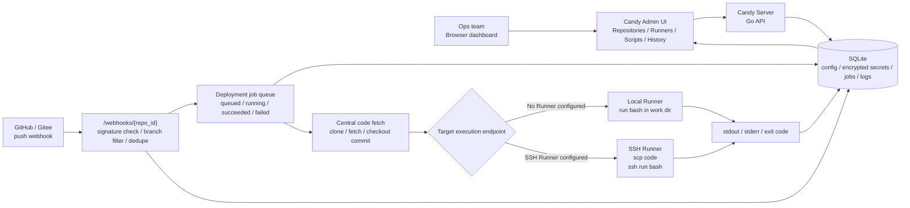

<p align="center">
  
</p>

<h1 align="center">Candy</h1>
<p align="center"><strong>Candy-Sweet Delivery</strong></p>

Candy is a lightweight webhook deployment control plane. It exposes a GitHub/Gitee-compatible webhook endpoint. After a push event arrives, the central service pulls the repository code and then deploys it on the local Runner or an SSH Runner.

Language: English | [Chinese version](./README.zh.md)

Terminology: this document uses Runner for the deployment execution endpoint. When no remote Runner is configured, the central service uses the local Runner to run deployments.

## Screenshots

### Overview


### Repositories


### Add repository


## Features

- Admin dashboard login. The super admin username and password come from environment variables.
- Repository configuration: Git URL, platform, webhook secret, deployment key, trigger branch, work directory, deployment script, whether to clean the worktree, and target Runner.
- GitHub `X-Hub-Signature-256` verification.
- Gitee `X-Gitee-Token` + `X-Gitee-Timestamp` signature verification, with legacy token equality fallback.
- Delivery deduplication, ignore non-target branches, and async job queueing.
- Central service clone/fetch and checkout to the commit referenced by the webhook.
- Local Runner: run `bash -lc` in the work directory.
- SSH Runner: after checkout on the central service, use `scp` to sync to the remote directory, then use `ssh` to run the script.
- SQLite persistence for repositories, Runners, job history, and logs; sensitive fields are stored with AES-GCM encryption.

## Architecture



In one sentence: Git platforms only deliver push events to Candy; Candy verifies the webhook, fetches code, selects the local or SSH Runner, runs the deployment script, and stores the full trace in SQLite for the admin dashboard.

## Getting Started

Backend:

```bash
cd backend
CANDY_APP_SECRET='change-me-to-a-long-random-secret' \
CANDY_ADMIN_PASSWORD='change-me' \
go run ./cmd/candyd
```

You can also create a `.env` file inside `backend/`; it will be loaded automatically on startup:

```bash
# backend/.env
CANDY_APP_SECRET=change-me-to-a-long-random-secret
CANDY_ADMIN_PASSWORD=change-me
```

Values in `.env` do not override existing shell environment variables. They are only used as a fallback.

Frontend development mode:

```bash
cd frontend
npm install
npm run dev
```

Open `http://localhost:5173`. If you run `npm run build` first, the backend will automatically serve frontend static files from `./frontend/dist` or `../frontend/dist`, and you can also access `http://localhost:8080` directly.

## Release Build

The project provides a single command to build both the frontend and the backend, and to generate release packages for multiple platforms:

```bash
make release
```

Equivalent to:

```bash
./scripts/build-release.sh
```

By default it will:

- run `npm ci`
- run `npm run build`
- build the backend for multiple platforms with `CGO_ENABLED=0 go build`
- package `candyd`, `frontend/dist`, `README.md`, `README.zh.md`, and `env.example` into each platform directory
- output `.tar.gz` archives for Unix platforms and `.zip` archives for Windows
- disable extended attributes and AppleDouble metadata on macOS packaging to avoid `LIBARCHIVE.xattr.com.apple.provenance` warnings when extracting on Linux

Default target platforms:

- `linux/amd64`
- `linux/arm64`
- `darwin/amd64`
- `darwin/arm64`
- `windows/amd64`
- `windows/arm64`

Release artifacts are written to `dist/release/`. Each release package contains:

```text
candy_<version>_<os>_<arch>/
  candyd
  frontend/dist/
  README.md
  README.zh.md
  env.example
```

The Windows binary is named `candyd.exe`. To run a release package, you can use the included `env.example`:

```bash
CANDY_APP_SECRET='change-me-to-a-long-random-secret' \
CANDY_ADMIN_PASSWORD='change-me-to-a-strong-password' \
./candyd
```

You can also copy `env.example` to `.env` and fill in real values. `candyd` will automatically load environment variables from `.env` in the same directory:

```bash
cp env.example .env
# Edit .env and set the real CANDY_APP_SECRET and CANDY_ADMIN_PASSWORD
./candyd
```

Optional arguments:

- `VERSION=0.2.0 make release`: set the release package version.
- `TARGETS="linux/amd64 darwin/arm64" make release`: build only the specified platforms.
- `OUT_DIR=/tmp/candy-release make release`: set the output directory.
- `SKIP_NPM_INSTALL=1 make release`: skip `npm ci` and reuse an existing `node_modules`.

The backend SQLite driver is cgo-free, so the default release build can use `CGO_ENABLED=0` for cross-platform compilation.

## Environment Variables

All variables can be provided either through shell environment variables or a `.env` file placed next to the executable. Values in `.env` do not override existing shell environment variables.

- `CANDY_ADDR`: backend listen address, default `:8080`.
- `CANDY_PUBLIC_URL`: public URL used when generating webhook addresses, default `http://localhost:8080`.
- `CANDY_DB_PATH`: SQLite file path, default `./data/candy.db`.
- `CANDY_DATA_DIR`: data directory for checkout cache and runtime files, default `./data`.
- `CANDY_APP_SECRET`: master key used to encrypt deployment keys, webhook secrets, and Runner SSH keys. Must be set and kept safe in production.
- `CANDY_ADMIN_USERNAME`: super admin username, default `super_admin`.
- `CANDY_ADMIN_PASSWORD`: super admin password, required. The service refuses to start if it is missing.
- `CANDY_WORKERS`: number of background deployment workers, default `2`.
- `CANDY_JOB_TIMEOUT_SECONDS`: timeout for a single deployment, default `1800`.
- `CANDY_LOGIN_USER_MAX_FAILURES`: maximum login failures per username within the window, default `5`.
- `CANDY_LOGIN_IP_MAX_FAILURES`: maximum login failures per source IP within the window, default `20`.
- `CANDY_LOGIN_FAILURE_WINDOW_SECONDS`: login failure counting window, default `900`.
- `CANDY_LOGIN_LOCKOUT_SECONDS`: temporary lockout duration after the threshold is exceeded, default `900`.
- `CANDY_TRUST_PROXY_HEADERS`: whether to trust `X-Forwarded-For` / `X-Real-IP` when identifying the source IP, default `false`. Only enable this if your reverse proxy already sanitizes these headers.

## Login Security

The login endpoint has brute-force protection enabled by default, and failure counters are persisted in SQLite:

- If the same username fails more than `CANDY_LOGIN_USER_MAX_FAILURES` times within `CANDY_LOGIN_FAILURE_WINDOW_SECONDS`, it is temporarily locked for `CANDY_LOGIN_LOCKOUT_SECONDS`.
- If the same source IP exceeds `CANDY_LOGIN_IP_MAX_FAILURES` failures in the same window, it is also temporarily locked.
- During lockout, the login endpoint returns HTTP `429 Too Many Requests` and sets the `Retry-After` header.
- Missing usernames and wrong passwords return the same generic "invalid username or password" message to avoid user enumeration.
- A dummy password hash is also computed for missing users to reduce timing-based user enumeration.
- By default, the TCP remote address is used as the source IP. `X-Forwarded-For` / `X-Real-IP` are only read when `CANDY_TRUST_PROXY_HEADERS=true`.
- When upgrading from older versions, if the database still contains the legacy weak `admin/admin123` account and the current super admin username is not `admin`, the service will remove that old account on startup.

If the service is deployed behind Nginx, Caddy, Traefik, or another reverse proxy and you need login limits based on the real client IP, make sure the proxy overwrites and sanitizes `X-Forwarded-For` / `X-Real-IP` before enabling `CANDY_TRUST_PROXY_HEADERS=true`.

## Webhook Setup

After creating a repository in the admin console, copy the webhook URL and secret from the repository row:

- GitHub: set the Webhook URL to `https://your-host/webhooks/{id}`, choose `application/json` as the content type, set the secret generated or configured in the console, and select the push event.
- Gitee: use the same URL, set the secret in the console, select the push event, and prefer Gitee's signature secret verification mode.

Only when the payload branch matches the repository's trigger branch will the job be queued.

## Runner Conventions

- When no Runner is selected, the central service clones/pulls directly in the repository work directory and runs the script.
- SSH Runner keeps a code cache at `CANDY_DATA_DIR/checkouts/repo-{id}` on the central service, then uses `scp -r` to sync to the remote work directory.
- If the Runner has a remote root directory and the repository work directory is relative, the final path becomes `runner.workRoot/repository.workDir`.
- Remote execution depends on `ssh`, `scp`, and `bash`; the central service depends on `git`.

## Production Notes

- Always set `CANDY_APP_SECRET` and a strong super admin password.
- Deploy behind HTTPS when possible.
- If `CANDY_TRUST_PROXY_HEADERS` is enabled, the reverse proxy must overwrite and sanitize the same headers from clients.
- Deployment scripts are a high-privilege capability; run the service and Runner with a low-privilege system account.
- Logs contain stdout/stderr. Avoid printing tokens, passwords, or private keys in scripts.
