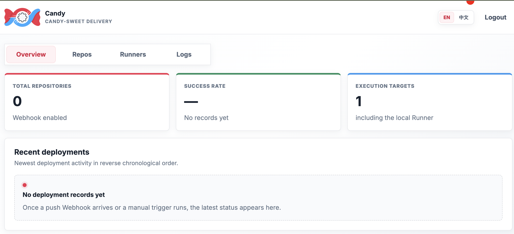
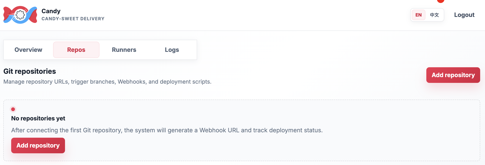
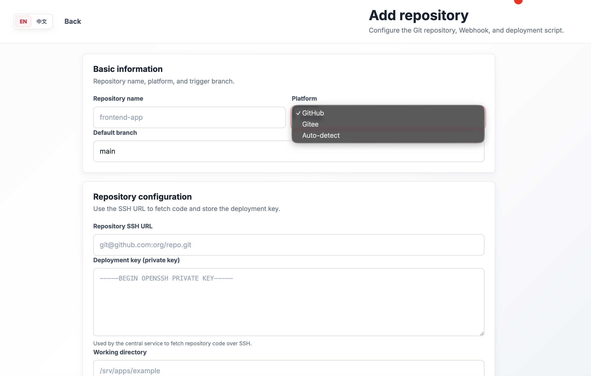
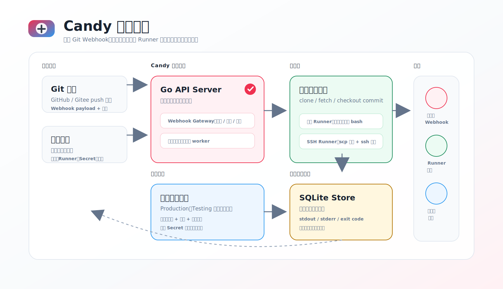

<p align="center">
  
</p>

<h1 align="center">Candy</h1>
<p align="center"><strong>Candy-Sweet Delivery</strong></p>

Candy 是一个轻量级 webhook 部署中枢。它对外暴露兼容 GitHub / Gitee webhook 的地址，收到 push 事件后由中心服务拉取仓库代码，再在本机 Runner 或 SSH Runner 上分发代码并执行部署脚本。

语言：中文 | [English](./README.md)

术语约定：本文统一使用 Runner 表示部署执行端；未配置远端执行端时，中心服务使用本机 Runner 执行部署。

## 系统截图

### 总览


### 仓库


### 新增仓库


## 当前功能

- 管理后台登录，超级管理员用户名和密码来自环境变量。
- 支持系统内置 `Production`、系统内置 `Testing` 和自定义运行环境，并为不同环境提供明显的界面色彩提示。
- 支持仓库源复用：共享 Git 地址和 deployment key，再按环境分别绑定分支、脚本和 Runner。
- GitHub `X-Hub-Signature-256` 校验。
- Gitee `X-Gitee-Token` + `X-Gitee-Timestamp` 标准签名校验。
- GitLab `X-Gitlab-Token` 校验。
- delivery 去重，非目标分支忽略，任务异步入队。
- 中心服务 clone/fetch，并 checkout 到 webhook 指定 commit。
- 本机 Runner：在工作目录中执行 `bash -lc`。
- SSH Runner：中心服务 checkout 后通过 `scp` 分发到远端目录，再用 `ssh` 执行脚本。
- Secret 管理：加密保存全局或仓库级敏感值，并在部署时以环境变量方式注入。
- SQLite 持久化仓库、Runner、任务历史和日志；敏感字段 AES-GCM 加密落库。

## 原理图



一句话理解：Candy 将 Git webhook 事件转成按环境隔离的部署任务。控制平面通过 `webhookId` 定位环境仓库绑定，将共享仓库源、环境级配置和 Secret 组合起来，再分发到本机或 SSH Runner 执行，并把完整操作轨迹写入 SQLite。

## 启动

后端：

```bash
cd backend
CANDY_APP_SECRET='change-me-to-a-long-random-secret' \
CANDY_ADMIN_PASSWORD='change-me' \
go run ./cmd/candyd
```

也可以在 `backend/` 目录下创建 `.env` 文件，程序启动时会自动加载：

```bash
# backend/.env
CANDY_APP_SECRET=change-me-to-a-long-random-secret
CANDY_ADMIN_PASSWORD=change-me
```

`.env` 中的变量不会覆盖已有的 shell 环境变量，仅作补充。

前端开发模式：

```bash
cd frontend
npm install
npm run dev
```

访问 `http://localhost:5173`。如果先执行 `npm run build`，后端默认会自动查找 `./frontend/dist` 或 `../frontend/dist` 托管前端静态文件，也可以直接访问 `http://localhost:8080`。

## Release 编译

项目提供一条命令同时构建前端和后端，并为多个平台生成 release 包：

```bash
make release
```

等价于：

```bash
./scripts/build-release.sh
```

默认会执行：

- `npm ci`
- `npm run build`
- `CGO_ENABLED=0 go build` 多平台后端编译
- 将 `candyd`、`frontend/dist`、`README.md`、`README.zh.md`、`env.example` 打入每个平台目录
- Unix 平台输出 `.tar.gz`，Windows 平台输出 `.zip`
- 在 macOS 上打包时会禁用扩展属性和 AppleDouble 元数据，避免 Linux 解压 `.tar.gz` 时出现 `LIBARCHIVE.xattr.com.apple.provenance` 之类的提示。

默认目标平台：

- `linux/amd64`
- `linux/arm64`
- `darwin/amd64`
- `darwin/arm64`
- `windows/amd64`
- `windows/arm64`

产物输出在 `dist/release/`。每个 release 包中包含：

```text
candy_<version>_<os>_<arch>/
  candyd
  frontend/dist/
  README.md
  README.zh.md
  env.example
```

Windows 包里的二进制名为 `candyd.exe`。运行 release 包时，可以参考包内 `env.example`：

```bash
CANDY_APP_SECRET='change-me-to-a-long-random-secret' \
CANDY_ADMIN_PASSWORD='change-me-to-a-strong-password' \
./candyd
```

也可以将 `env.example` 复制为 `.env` 并填入实际值，`candyd` 会自动从同目录下的 `.env` 加载环境变量：

```bash
cp env.example .env
# 编辑 .env，填入正式的 CANDY_APP_SECRET 和 CANDY_ADMIN_PASSWORD
./candyd
```

可选参数：

- `VERSION=0.2.0 make release`：设置 release 包版本号。
- `TARGETS="linux/amd64 darwin/arm64" make release`：只构建指定平台。
- `OUT_DIR=/tmp/candy-release make release`：设置产物目录。
- `SKIP_NPM_INSTALL=1 make release`：跳过 `npm ci`，使用已有 `node_modules`。

后端 SQLite driver 使用 cgo-free 实现，因此默认 release 构建可以使用 `CGO_ENABLED=0` 进行跨平台编译。

## 关键环境变量

所有变量均可通过 shell 环境变量或与可执行文件同目录的 `.env` 文件提供。`.env` 中的值不会覆盖已有的 shell 环境变量。

- `CANDY_ADDR`：后端监听地址，默认 `:8080`。
- `CANDY_PUBLIC_URL`：生成 webhook 地址时使用的公网 URL，默认 `http://localhost:8080`。
- `CANDY_DB_PATH`：SQLite 文件路径，默认 `./data/candy.db`。
- `CANDY_DATA_DIR`：中心服务 checkout 缓存和运行数据目录，默认 `./data`。
- `CANDY_APP_SECRET`：加密 deployment key、webhook secret、Runner SSH key 的主密钥，生产环境必须设置并妥善保存。
- `CANDY_ADMIN_USERNAME`：超级管理员用户名，默认 `super_admin`。
- `CANDY_ADMIN_PASSWORD`：超级管理员密码，必须设置；未设置时服务会拒绝启动。
- `CANDY_WORKERS`：后台部署 worker 数量，默认 `2`。
- `CANDY_JOB_TIMEOUT_SECONDS`：单次部署超时，默认 `1800`。
- `CANDY_LOGIN_USER_MAX_FAILURES`：同一用户名在窗口期内允许的登录失败次数，默认 `5`。
- `CANDY_LOGIN_IP_MAX_FAILURES`：同一来源 IP 在窗口期内允许的登录失败次数，默认 `20`。
- `CANDY_LOGIN_FAILURE_WINDOW_SECONDS`：登录失败计数窗口，默认 `900`。
- `CANDY_LOGIN_LOCKOUT_SECONDS`：超过阈值后的临时锁定时间，默认 `900`。
- `CANDY_TRUST_PROXY_HEADERS`：是否信任 `X-Forwarded-For` / `X-Real-IP` 识别来源 IP，默认 `false`。仅在反向代理已经清洗这些请求头时启用。

## 环境

Candy 支持多个运行环境。全新安装会自动包含 `Production` 和 `Testing`，管理员也可以在控制台中新增自定义环境。

Candy 仅支持当前这套按环境组织的 schema，不再提供旧数据库结构的原地自动升级；从历史版本迁移时，请使用全新数据库重新初始化服务。

- Runner、Secret、部署绑定和部署历史按环境隔离
- 界面会用环境专属强调色提示当前操作环境，降低误操作风险
- 单个系统实例始终至少保留一个环境

## 仓库复用

Candy 现在将仓库信息拆成两层：

- `仓库源`：全局共享的 Git 地址和 deployment key，只保存一次
- `环境仓库绑定`：当前环境下的分支、工作目录、Webhook secret、部署脚本和 Runner 选择

这样同一个仓库源可以在 `Production` 用 `main` 分支，在 `Staging` 用 `develop` 分支，而不用重复配置 deployment key。

## 登录安全策略

登录接口默认启用防暴力破解保护，并将失败计数持久化到 SQLite：

- 同一用户名在 `CANDY_LOGIN_FAILURE_WINDOW_SECONDS` 窗口内失败达到 `CANDY_LOGIN_USER_MAX_FAILURES` 次后，会被临时锁定 `CANDY_LOGIN_LOCKOUT_SECONDS`。
- 同一来源 IP 在同一窗口内失败达到 `CANDY_LOGIN_IP_MAX_FAILURES` 次后，也会被临时锁定。
- 锁定期间登录接口返回 HTTP `429 Too Many Requests`，并设置 `Retry-After` 响应头。
- 用户名不存在和密码错误统一返回 `用户名或密码错误`，避免通过错误信息枚举用户。
- 对不存在的用户也会执行 dummy password hash，降低通过响应时间差异枚举用户的风险。
- 默认使用 TCP 连接的 remote address 作为来源 IP；只有设置 `CANDY_TRUST_PROXY_HEADERS=true` 后才会读取 `X-Forwarded-For` / `X-Real-IP`。

如果服务部署在 Nginx、Caddy、Traefik 等反向代理之后，并且需要按真实客户端 IP 限制登录，请确保代理层覆盖并清洗客户端传入的 `X-Forwarded-For` / `X-Real-IP` 后，再开启 `CANDY_TRUST_PROXY_HEADERS=true`。

## Webhook 配置

在管理台创建环境仓库绑定后，复制仓库行中的 webhook 地址和密钥：

- GitHub：Webhook URL 填 `https://your-host/webhooks/{webhookId}`，Content type 选 `application/json`，Secret 填管理台生成或设置的 secret，事件选择 push。
- Gitee：Webhook URL 填同一个地址，密钥填管理台 secret，选择 push 事件；推荐使用 Gitee 的签名密钥校验模式。
- GitLab：Webhook URL 填 `https://your-host/webhooks/{webhookId}`，Secret Token 填 Candy 中展示的密钥，并启用 Push events 触发器。

只有 payload 中的分支等于仓库配置的触发分支时，任务才会入队。

## Secret 注入

可以在 Secrets 页创建 Secret。变量名必须是合法环境变量名，例如 `DATABASE_URL` 或 `API_TOKEN`。Secret 值会加密保存到 SQLite，只在部署进程中以环境变量形式暴露。

环境级全局 Secret 对该环境下所有仓库绑定生效。仓库级 Secret 只对对应环境仓库绑定生效，并且同名时会覆盖环境级全局 Secret。部署时，Candy 会把这些 Secret 和 `CANDY_REPOSITORY_NAME` 等内置变量一起注入，脚本和应用可以通过普通环境变量读取。

## Runner 约定

- 未选择 Runner 时，中心服务直接在仓库工作目录 clone/pull 并执行脚本。
- SSH Runner 会先在中心服务的 `CANDY_DATA_DIR/checkouts/repo-{id}` 维护代码缓存，再用 `scp -r` 同步到远端工作目录。
- 如果 Runner 配置了远端根目录，而仓库工作目录是相对路径，最终目录会拼成 `runner.workRoot/repository.workDir`。
- 远端执行依赖 `ssh`、`scp`、`bash`；中心服务依赖 `git`。

## 生产注意事项

- 一定要设置 `CANDY_APP_SECRET` 和强超级管理员密码。
- 建议部署在 HTTPS 反向代理后。
- 若启用 `CANDY_TRUST_PROXY_HEADERS`，必须在反向代理层覆盖并清洗客户端传入的同名请求头。
- 部署脚本是高权限能力，建议用低权限系统用户运行服务和 Runner。
- 日志会记录 stdout/stderr，请避免在脚本中打印 token、密码或私钥。
